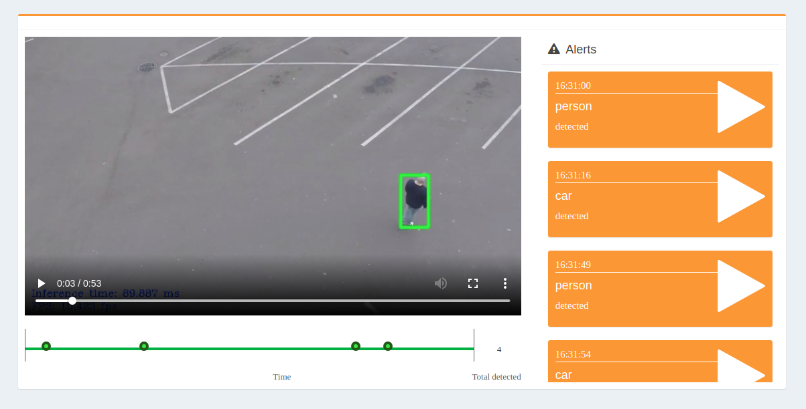
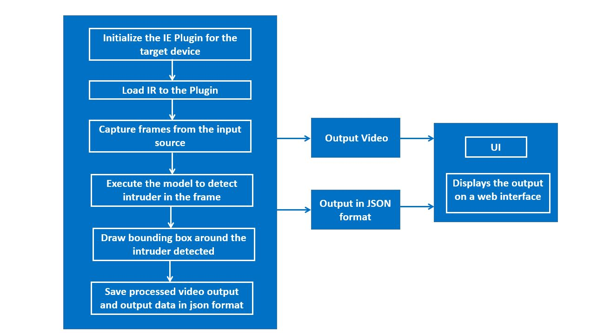

# Intruder Detector

| Details           |          |
|-----------------------|-----------|
| Target OS:            |  Ubuntu\* 16.04  |
| Programming Language: |  C++      |
| Time to Complete:    |  50-70min |

This reference implementation is also [available in Python*](https://github.com/intel-iot-devkit/reference-implementation-private/blob/master/intruder-detector-python/README.md)



An application capable of detecting any number of objects from a video input.

## What it Does
This application is one of a series of IoT reference implementations aimed at instructing users on how to develop a working solution for a particular problem. It demonstrates how to create a smart video IoT solution using Intel® hardware and software tools. This solution detects any number of objects in a designated area, providing the number of objects in the frame and total count.

## How it Works
The application uses the Inference Engine included in the Intel® Distribution of OpenVINO™ toolkit. A trained neural network detects objects within a designated area by displaying a green bounding box over them, and registers them in a logging system.



## Requirements
### Hardware
* 6th to 8th Generation Intel® Core™ processor with Intel® Iris® Pro graphics or Intel® HD Graphics

### Software
* [Ubuntu\* 16.04 LTS](http://releases.ubuntu.com/16.04/)<br>
   **Note**: Use kernel versions 4.14+ with this software.<br> 
    Determine the kernel version with the uname command. 
    ```
    uname -a
    ```
* OpenCL™ Runtime Package
* Intel® Distribution of OpenVINO™ toolkit 2019 R1 Release

## Setup

### Install Intel® Distribution of OpenVINO™ toolkit
Refer to https://software.intel.com/en-us/articles/OpenVINO-Install-Linux on how to install and setup the Intel® Distribution of OpenVINO™ toolkit.

You will need the OpenCL™ Runtime Package if you plan to run inference on the GPU as shown by the instructions below. It is not mandatory for CPU inference.

### FFmpeg
FFmpeg is installed separately from the Ubuntu repositories:
```
sudo apt update
sudo apt install ffmpeg
```
## Configure the Application

### Which Model to Use

The application works with any object-detection model, provided it has the same input and output format of the SSD model.
The model can be any object detection model:
- Downloaded using the **model downloader**, provided by Intel® Distribution of OpenVINO™ toolkit.

- Built by the user.<br>

By default, this application uses the **person-vehicle-bike-detection-crossroad-0078** Intel® model, that can be downloaded using the **model downloader**. The **model downloader** downloads the __.xml__ and __.bin__ files that is used by the application. 

#### Download the model

- Go to the **model_downloader** directory using the following command: 
    ```
    cd /opt/intel/openvino/deployment_tools/tools/model_downloader
    ```
- Specify which model to download with __--name__:
    ```
    sudo ./downloader.py --name person-vehicle-bike-detection-crossroad-0078
    ```
- To download the model for FP16, run the following commands:
    ```
    sudo ./downloader.py --name person-vehicle-bike-detection-crossroad-0078-fp16
    ```
The files will be downloaded inside ``/opt/intel/openvino/deployment_tools/tools/model_downloader/Security/object_detection/crossroad/0078/dldt/`` directory.

### The labels file
In order to work, this application requires a _labels_ file associated with the model being used for detection.  
All detection models work with integer labels and not string labels (e.g. for the **person-vehicle-bike-detection-crossroad-0078** model, the number 1 represents the class "person"), that is why each model must have a _labels_ file, which associates an integer (the label the algorithm detects) with a string (denoting the human-readable label).   


The _labels_ file is a text file containing all the classes/labels that the model can recognize, in the order that it was trained to recognize them (one class per line).
For the **person-vehicle-bike-detection-crossroad-0078** model, we provide the class file _labels.txt_ in the resources folder.


### The config file
The _application/resources/conf.txt_ contains the path to the videos that will be used by the application, followed by the labels to be detected on those videos. All labels (intruders) defined will be detected on all videos.   
The lines of the _conf.txt_ file is of the form `video: <path/to/video>` or `intruder: <label>`   
The labels used in the _conf.txt_ file must coincide with the labels from the _labels_ file.

Example of the _conf.txt_ file:
```
video: videos/video1.mp4
video: videos/video2.avi
intruder: person
intruder: dog
```

The application can use any number of videos for detection, but the more videos the application uses in parallel, the more the frame rate of each video scales down. This can be solved by adding more computation power to the machine the application is running on.


### What input video to use
The application works with any input video.
Sample videos for object detection are provided [here](https://github.com/intel-iot-devkit/sample-videos/).  


For first-use, we recommend using the [person-bicycle-car-detection]( https://github.com/intel-iot-devkit/sample-videos/blob/master/person-bicycle-car-detection.mp4) video.   
For example:
```
video: sample-videos/person-bicycle-car-detection.mp4
intruder: person
intruder: bicycle
intruder: car
```
This video can be downloaded directly, via the `video_downloader` Python script provided. 
Go to the intruder-detector directory and run the following commands in the terminal:
```
python3 video_downloader.py
```
The video is automatically downloaded to the `application/resources/` folder.


### Using the camera stream instead of the video file
Replace the `path/to/video` in the _application/resources/conf.txt_  file with the camera ID, where the ID is taken from your video device (the number X in /dev/videoX).   
For example:
```
video: 0
intruder: person
intruder: bicycle
intruder: car
```

On Ubuntu, to list all available video devices use the following command:
```
ls /dev/video*
```


## Build and start the application

Configure the environment to use the Intel® Distribution of OpenVINO™ toolkit by exporting environment variables:
```
source /opt/intel/openvino/bin/setupvars.sh
```

To build, go to `intruder-detector/application` directory and run the following commands:

```
mkdir -p build && cd build
cmake ..
make 
```


## Run the application

If not in build folder, go there by using:

```
cd build/
```

To see a list of the various options:

```
./intruder-detector -h
```

<!-- To run the application with the needed models:

```
./intruder-detector -d CPU -l ../resources/labels.txt -m /opt/intel/openvino/deployment_tools/tools/model_downloader/Security/object_detection/crossroad/0078/dldt/person-vehicle-bike-detection-crossroad-0078.xml
``` -->

<!-- ## Running on different hardware -->
A user can specify what target device to run on by using the device command-line argument `-d` followed by one of the values `CPU`, `GPU`, `MYRIAD`, `FPGA` or `HDDL`.

### Running on the CPU
Although the application runs on the CPU by default, this can also be explicitly specified through the `-d CPU` command-line argument:
```
./intruder-detector -d CPU -l ../resources/labels.txt -m /opt/intel/openvino/deployment_tools/tools/model_downloader/Security/object_detection/crossroad/0078/dldt/person-vehicle-bike-detection-crossroad-0078.xml
```


### Running on the integrated GPU
To run on the integrated Intel® GPU with floating point precision 32 (FP32) model, use the `-d GPU` command-line argument:
```
./intruder-detector -d GPU -l ../resources/labels.txt -m /opt/intel/openvino/deployment_tools/tools/model_downloader/Security/object_detection/crossroad/0078/dldt/person-vehicle-bike-detection-crossroad-0078.xml
```

To run on the integrated Intel® GPU with floating point precision 16 (FP16):
```
./intruder-detector -d GPU -l ../resources/labels.txt -m /opt/intel/openvino/deployment_tools/tools/model_downloader/Security/object_detection/crossroad/0078/dldt/person-vehicle-bike-detection-crossroad-0078-fp16.xml
```

### Running on the Intel® Neural Compute Stick
To run on the Intel® Neural Compute Stick, use the `-d MYRIAD` command-line argument:
```
./intruder-detector -d MYRIAD -l ../resources/labels.txt -m /opt/intel/openvino/deployment_tools/tools/model_downloader/Security/object_detection/crossroad/0078/dldt/person-vehicle-bike-detection-crossroad-0078-fp16.xml
```
**Note:** The Intel® Neural Compute Stick can only run on FP16 models. The model that is passed to the application, through the `-m <path_to_model>` command-line argument, must be of data type FP16.

### Running on the HDDL
To run on the HDDL, use the `-d HETERO:HDDL,CPU ` command-line argument:
```
./intruder-detector -d HETERO:HDDL,CPU -l ../resources/labels.txt -m /opt/intel/openvino/deployment_tools/tools/model_downloader/Security/object_detection/crossroad/0078/dldt/person-vehicle-bike-detection-crossroad-0078-fp16.xml
```
**Note:** The HDDL-R can only run on FP16 models. The model that is passed to the application, through the `-m <path_to_model>` command-line argument, must be of data type FP16.


### Running on the FPGA

Before running the application on the FPGA,  program the AOCX (bitstream) file.<br>
Use the setup_env.sh script from [fpga_support_files.tgz](http://registrationcenter-download.intel.com/akdlm/irc_nas/12954/fpga_support_files.tgz) to set the environment variables.<br>

```
source /home/<user>/Downloads/fpga_support_files/setup_env.sh
```

The bitstreams for HDDL-F can be found under the `/opt/intel/openvino/bitstreams/a10_vision_design_bitstreams` folder. To program the bitstream use the below command: <br>

```
aocl program acl0 /opt/intel/openvino/bitstreams/a10_vision_design_bitstreams/2019R1_PL1_FP11_RMNet.aocx
```

For more information on programming the bitstreams, please refer the link: https://software.intel.com/en-us/articles/OpenVINO-Install-Linux-FPGA#inpage-nav-11

To run the application on the FPGA, use the `-d HETERO:FPGA,CPU` command-line argument:

```
./intruder-detector -d HETERO:FPGA,CPU -l ../resources/labels.txt -m /opt/intel/openvino/deployment_tools/tools/model_downloader/Security/object_detection/crossroad/0078/dldt/person-vehicle-bike-detection-crossroad-0078-fp16.xml
```

### Loop the input video 
By default, the application reads the input videos only once, and ends when the videos end.
In order to not have the sample videos end, thereby ending the application, the option to continuously loop the videos is provided.    
This is done by running the application with the `-lp true` command-line argument:

```
./intruder-detector -lp true -d CPU -l ../resources/labels.txt -m /opt/intel/openvino/deployment_tools/tools/model_downloader/Security/object_detection/crossroad/0078/dldt/person-vehicle-bike-detection-crossroad-0078.xml
```

This looping does not affect live camera streams, as camera video streams are continuous and do not end.


## Using the browser UI

The default application uses a simple user interface created with OpenCV.
A web based UI with more features is also provided [here](./UI).
